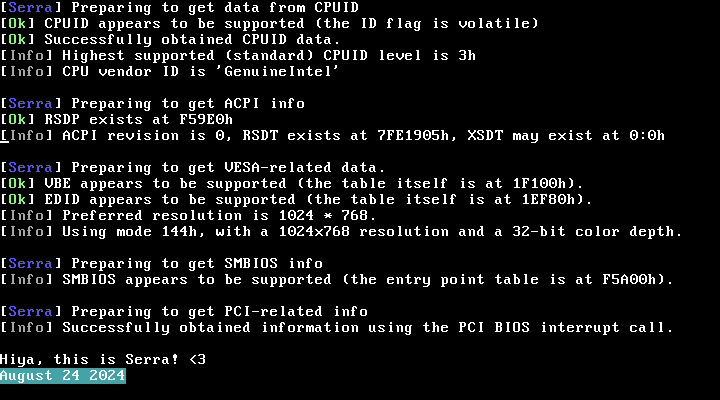

# Serra
### TODO - Show logo, give a better (less technical) description, show a proper roadmap.
An x86 bootloader under construction <3

&nbsp;

## Roadmap (Legacy/BIOS-only for now)

### 1st stage (7C00h -> 7E00h)

- Bootsector **Done**
- Protected mode **Done**
- Set up a proper GDT **Done**

### 2nd stage (7E00h -> 9E00h)

- String/terminal functions **Done, and now with printf!**
- Some way of going to and from real mode **Done**
- Basic disk read support (using EDD / int 13h) **Done**
- Basic FAT filesystem support (FAT16 and FAT32) **Done, read-only**
- Set up a proper IDT **Done**
- Transferring all the info from the above to the next stage **Done, a little barebones though**
- Loading the next stage **Done**

### 3rd stage (20000h -> ?????h)

- String/terminal functions **Done, and now with printf!**
- Some way of going to and from real mode **Done**
- Interrupts and exceptions **Done (but a little bare-bones)**
- E820 / memory map **Done**
- CPUID ***Somewhat done? (haven't scanned for PAE/long mode yet)***
- ACPI **Done, if a little bare-bones**
- VESA/EDID **Done**
- SMBIOS **Done (but a little bare-bones)**
- Disk drivers (int13h) *Mostly done already*
- Filesystem drivers *Mostly done already*
- Writing a (simple) physical memory manager *Very bare-bones*
- Paging, 32-bit and PAE/long-mode
- Other miscellaneous things *In progress*
- Loading the next stage (with long mode!)

### Common stage (?????h)

- Basically all of the above, but with long-mode support, and also with an EFI stub that
does the same job as the BIOS/Legacy bootloader stub.

- Should probably work on some sort of standard protocol (maybe reuse Multiboot/Limine?)

&nbsp;

## Disclaimer
This project has been released under the MIT license. For more information, please
refer to the accompanying license agreement. <3

*Last updated on January 3rd 2025*
