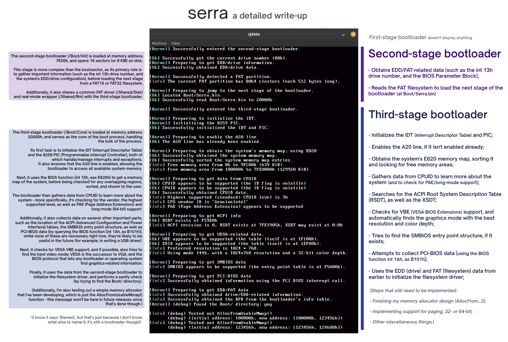

# Serra - a boot manager under construction <3

&nbsp;

  </img>

&nbsp;

Serra is an **open-source x86 boot manager** currently under construction.

My goal here is to develop a universal and reliable boot manager that works
across different systems, with a focus on code quality and user experience.

It's currently a work in progress - see the [roadmap](#roadmap) below - but
my goal is to have it ready by **early June**.

&nbsp;

  </img>

&nbsp;

## Build process

> [!IMPORTANT]
> You'll need to do this on Linux (or an environment like WSL); other operating systems aren't supported.

In order to build Serra, you will need the following tools:
> This project uses the C23 standard, which is fairly new, so *please* make sure you're using the latest version.

- **Assemblers and (cross) compilers**
- - `nasm`, or any other compatible **x86** assembler;
- - `i686-elf-gcc`, or any other **x86 native ELF** compiler;
- - - This will be used to build `Boot/Legacy`, and ***must** have full C23 support (GCC 15+, Clang 19+)*;
- - `x86_64-elf-gcc`, or any other **x64 native ELF** compiler;
- - - This will be used to build `Common/`, and ***must** have full C23 support (GCC 15+, Clang 19+)*;
- - `x86_64-w64-mingw32-gcc`, or any other **x64 Windows/PE** compiler.
- - - This will be used to build `Boot/Efi`, and ***must** have partial C23 support (GCC 13+, Clang 16+)*;
- - - On Ubuntu 24.04+, you can use `sudo apt install binutils-mingw-w64 gcc-mingw-w64`.

- **Build tools**
- - `make` (GNU make), for the build system itself;
- - `dd`, `mtools` and `sfdisk`, to compile the final disk image.

- **Other utilities *(optional)***
- - `qemu` or `bochs`, to run the final disk image;
- - `gdb`, to debug the boot manager;
- - `ovmf`, to use as UEFI firmware.

Understandably, this isn't the most straightforward setup, and you *will* need
to make your own cross compilers ([this guide](https://wiki.osdev.org/GCC_Cross-Compiler)
is pretty useful), but once everything is done, it should be as easy as
running `make all`.

  
Building and running the boot manager

  ### Configuring the boot manager
  This is still a work-in-progress, but you can configure how Serra is built
  and configured in **`makefile.config` > *Build Options***.

  ### Building the boot manager
  - `make clean`: Clean all leftover files (.o, .bin, .elf, .img, etc.);
  - `make compile`: Compile any remaining files;
  - **`make all`: Build everything**;

  ### Running the boot manager
  - **`make run`: Run with QEMU**;
  - `make runbochs`: Run with Bochs;
  - **`make runefi`: Run EFI with QEMU**;
  - `make rungdb`: Run with QEMU using the GDB debugger;
  - `make runkvm`: Run with QEMU using the KVM emulation layer;
  - `make runint`: Run with QEMU showing exceptions.

&nbsp;

## Roadmap

- Start working on the kernel, in `Common/`.
- - Review the kernel info tables;
- - Implement a few common drivers, for things like graphics support, PCI, etc.;
- - Add filesystem support (something involving a VFS maybe?);
- Add the actual boot manager functionality (support for boot protocols);
- Create a simple user interface (GUI *and* text-mode as fallback)

&nbsp;

## Disclaimer

This project has been released under the [MIT license](https://choosealicense.com/licenses/mit/).
For more information, please refer to the accompanying license agreement. <3

*(last updated on May 12th 2025)*
